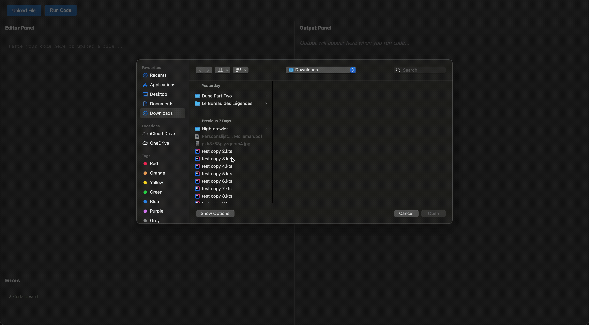
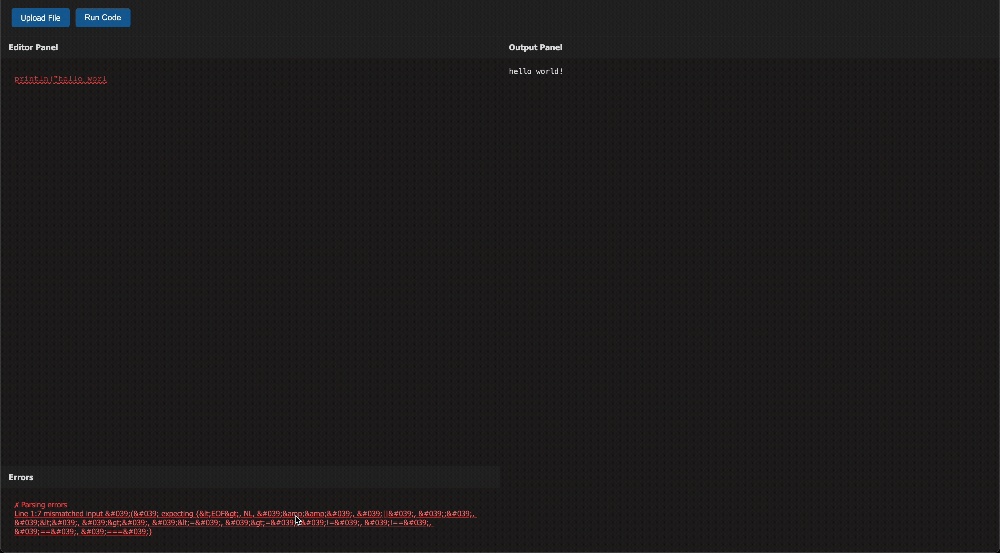
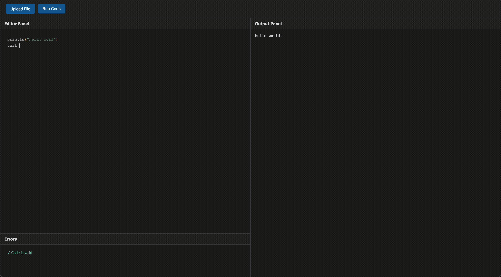

# Kotlin IDE Integration Backend

This project is a Ktor-based backend server that provides IDE-like features for Kotlin scripts. It's designed to be a companion for a web-based code editor, offering services like code validation, execution, and syntax highlighting.

## Try it Online

**[Try the live application here!](https://kotlin-ide-app-22323.wonderfulsmoke-e4f4394a.westeurope.azurecontainerapps.io/)**

## Features

- **File Upload**: Upload Kotlin scripts.
- **Code Execution**: Upload and execute Kotlin scripts and see the output.
- **Syntax Highlighting**: Highlights keywords to improve code readability.
- **Code Validation**: Validates code and highlights syntax errors.
- **Error Navigation**: Click on parsing or execution errors to jump directly to the problematic line.

## Demonstrations

### File Upload

### Parsing Error Navigation

### Runtime Error Navigation

## Testing, Building and Running

To build or run the project, use one of the following tasks:

| Task                                    | Description                                                          |
| -----------------------------------------|---------------------------------------------------------------------- |
| `./gradlew test`                        | Run the tests                                                        |
| `./gradlew build`                       | Build everything                                                     |
| `./gradlew run`                         | Run the server                                                       |

